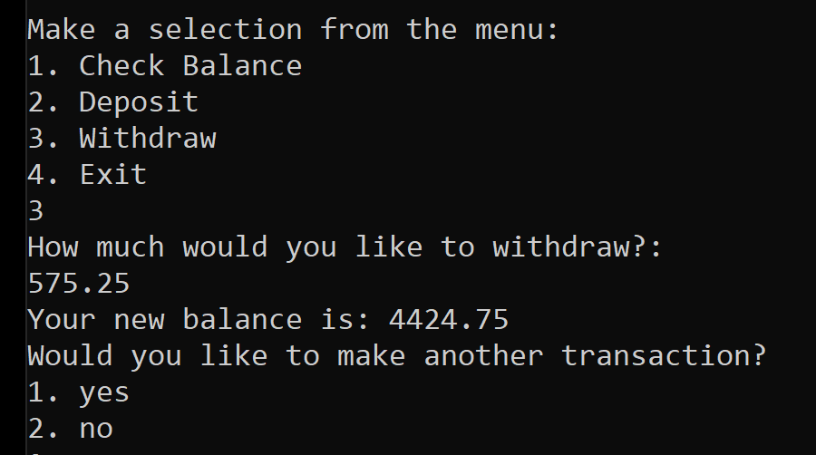

# Lab02: Fake ATM
Author: Scott Falbo Version: 1.0.0 

## Overview
This is a terminal ATM user interface.  It's functions include checking balance, depositing, and withdrawing.  The user may perform multiple transactions before choosing to exit.

## Getting Started
+ From the command line: `git clone https://github.com/scottfalbo/lab02-unit-tests.git`
+ `git checkout scott-lab02`
+ Open in Visual Studio and run the app from `program.cs`
### Terminal user interface
1. **Check Balance** - Returns account balance.
2. **Deposit** - Deposit funds, must be a positive amount.
3. **Withdraw** - Withdraw funds, must be a positive amount and not over draw the account balance.
4. **Exit** - Exit the app.

## Example

## Change Log
+ 1.0.1 - *01/12/2021 5:55pm* - My first shamefully late commit.  Framed out all of the app methods.  Built a switch controller handle the user input.  
+ Wrote three tests.  One each for the methods `ViewBalance`, `Deposit`, and `Withdraw` to ensure basic functionality.
+ 1.0.2 - *01/12/2021 6:05pm* - Added `AnotherTransaction` method to ask the user if they would like to perform more tasks.  I used a global `bool exit`, to control the menu loop.
+ 1.0.3 - *01/12/2021 6:15pm* - Method `GetAmount` gets the amount the user wishes to deposit or withdraw.  
+ 1.0.4 - *01/12/2021 6:20pm* - Hooked all of the methods up and got basic functionality in the terminal.
+ 1.0.5 - *01/12/2021 6:35pm* - Method `PowerDown` to switch the `exit` variable should the user choose to exit either via menu or prompt.
+ 1.0.6 - *01/12/2021 6:45pm* - Made a series of tests for a user amount validation input method.
+ 1.0.7 - *01/12/2021 6:55pm* - `ValidateInputAmount` ensures that the input `string` is convertible to a `decimal`, and if so that it is `greater than 0`. 
+ 1.0.8 - *01/12/2021 7:40pm* - Wrote a test and added functionality to the `Withdraw` method to ensure the user does not over draw the balance.  If so they alerted and redirected to the main menu.
+ 1.0.9 - *01/12/2021 7:50pm* - Commented and tidied a bit.
+ 1.1.0 - *01/12/2021 9:20pm* - `OverdrawTest` started randomly failing, I honestly don't think I changed anything and it started working again.
+ Also updated README 

## Attribution
+ Worked with Alan Hung and David Dicken's in lab today.  We talked out most of the logic and did some coding together.
+ [Microsoft Docs, `switch`](https://docs.microsoft.com/en-us/dotnet/csharp/language-reference/keywords/switch) 